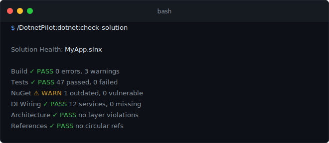
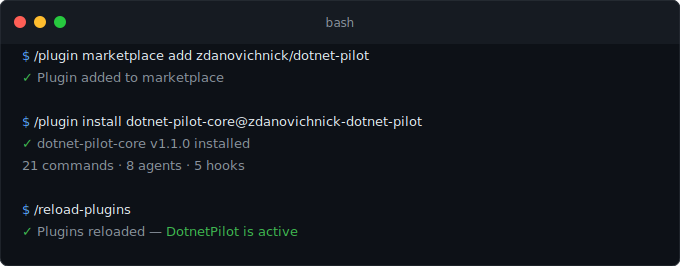
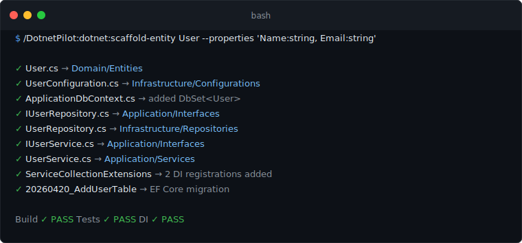
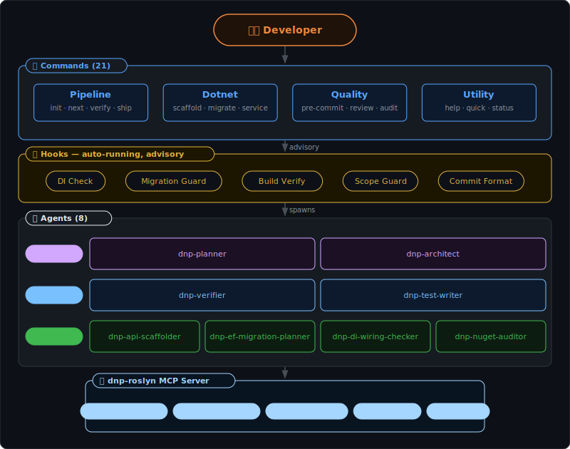

<div align="center">

# 🚀 DotnetPilot

**A .NET development assistant plugin for [Claude Code](https://claude.ai/code)**

Roslyn-backed DI verification &nbsp;·&nbsp; EF Core migration safety &nbsp;·&nbsp; Clean-architecture enforcement &nbsp;·&nbsp; Convention-aware scaffolders

[](LICENSE)
[](https://dotnet.microsoft.com/)
[](https://claude.ai/code)
[]()

<br>

*21 commands &nbsp;·&nbsp; 8 specialized agents &nbsp;·&nbsp; 5 advisory hooks*

</div>

---

## Why DotnetPilot?

AI coding tools make these .NET mistakes constantly — DotnetPilot fixes them at the source:

| Without DotnetPilot | With DotnetPilot |
|---|---|
| Creates services, forgets DI registration | `dnp-di-wiring-checker` catches it immediately |
| Manually edits EF migration files (breaks the chain) | `add-migration` always uses `dotnet ef migrations add` |
| Puts domain models in the wrong project layer | `dnp-architect` enforces clean architecture in real time |
| Skips `dotnet build` verification | Build hook verifies after every scaffold |
| Ignores existing patterns in your codebase | Every scaffolder reads your conventions before writing code |

<br>

<div align="center">

</div>

---

## 📦 Installation

### Step 1 — Install the plugin

**From GitHub (standard)**

```
/plugin marketplace add https://github.com/zdanovichnick/dotnet-pilot
/plugin install dotnet-pilot@dotnet-pilot
/reload-plugins
```

<div align="center">

</div>

**From a local clone**

Use this when you cloned the repo and want to run your own build, or contribute changes.

Permanent install (user scope — persists across sessions):

```
# Windows
/plugin marketplace add D:\Projects\POC\dotnet-pilot

# macOS / Linux
/plugin marketplace add /Users/you/projects/dotnet-pilot
```

Then activate it:

```
/plugin install dotnet-pilot@dotnet-pilot
/reload-plugins
```

Session-only (no install — plugin is active only while this Claude Code process is running):

```bash
# Windows
claude --plugin-dir "D:\Projects\POC\dotnet-pilot"

# macOS / Linux
claude --plugin-dir "/Users/you/projects/dotnet-pilot"
```

> After editing plugin source (commands, agents, hooks), run `/reload-plugins` to pick up changes without restarting.

### Step 2 — Install the Roslyn MCP server

```bash
dotnet tool install -g DotnetPilot.Mcp.Roslyn
```

The plugin's `.mcp.json` auto-starts `dnp-roslyn` when Claude Code loads. It requires a `.sln` or `.slnx` file in your working directory.

### Step 3 — Enable Context7 (recommended)

In Claude Code, enable the **Context7** MCP server at the account level — planning agents use it for live NuGet / ASP.NET Core / EF Core documentation.

### Step 4 — Verify

```
/DotnetPilot:utility:help            → should list 21 commands
/DotnetPilot:dotnet:check-solution   → validates build, tests, DI, architecture
```

---

## ⚡ Quick Start

### Initialize your project (once per solution)

```
/DotnetPilot:pipeline:init
```

Scans your solution, detects architecture style / test framework / EF contexts, and creates a user-scoped `.planning/` directory. Then asks three questions: what are you building, who is it for, what constraints exist.

### Scaffold a full entity in one command

<div align="center">

</div>

### Or go even faster with the shorthand

```
/DotnetPilot:dotnet:scaffold-entity Category --properties 'Name:string, SortOrder:int'
/DotnetPilot:dotnet:scaffold-api Category
/DotnetPilot:dotnet:add-migration AddCategoryTable
```

---

## 🗺️ Architecture

<div align="center">

</div>

**Flow:** Developer invokes a `/DotnetPilot:*` command → the command spawns the right agent → the agent calls the Roslyn MCP server for semantic C# analysis (DI completeness, architecture violations, EF Core models, symbol references). Hooks run automatically on file writes and git events, feeding advisory feedback back to the command layer — they never block by default.

---

## 📋 Commands

### Pipeline — lightweight project lifecycle

| Command | Usage | What it does |
|---|---|---|
| `pipeline:init` | `/DotnetPilot:pipeline:init [--refresh]` | Scan solution; create `.planning/` with config, solution map, and project docs |
| `pipeline:next` | `/DotnetPilot:pipeline:next` | Read-only advisory: suggests the next sensible command |
| `pipeline:verify` | `/DotnetPilot:pipeline:verify` | Build + tests + DI + architecture deep-scan — go/no-go before ship |
| `pipeline:ship` | `/DotnetPilot:pipeline:ship [--draft]` | Create PR via `gh pr create` after final quality gate |

### Dotnet — targeted scaffolding

| Command | Usage | What it does |
|---|---|---|
| `dotnet:scaffold-entity` | `scaffold-entity <name> [--properties '...']` | Full entity stack: domain · config · repo · service · DI · migration |
| `dotnet:scaffold-api` | `scaffold-api <entity> [--minimal]` | Controller or minimal API + DTOs + validation + DI |
| `dotnet:add-service` | `add-service <name> [--lifetime scoped\|transient\|singleton]` | Service + interface + DI registration + test scaffold |
| `dotnet:add-endpoint` | `add-endpoint <controller> <method> <route> [--with-dto]` | Single endpoint added to an existing controller, matching its patterns |
| `dotnet:add-migration` | `add-migration <name> [--context <Name>]` | Safe EF Core migration with breaking-change detection and chain validation |
| `dotnet:add-project` | `add-project <name> <type>` | New project (classlib · web · xunit · worker · console) with correct layer refs |
| `dotnet:run-tests` | `run-tests [project] [--coverage] [--filter ...]` | Tests with failure diagnosis via `dnp-test-writer` |
| `dotnet:check-solution` | `check-solution [--fix]` | Full solution health check (build · tests · NuGet · DI · arch · refs) |

### Quality — safety checks

| Command | Usage | What it does |
|---|---|---|
| `quality:pre-commit` | `/DotnetPilot:quality:pre-commit` | Build → test → format → DI → arch, fail-fast |
| `quality:review` | `review [--depth quick\|standard\|deep]` | .NET-focused code review of staged changes |
| `quality:audit-nuget` | `/DotnetPilot:quality:audit-nuget` | Vulnerability + outdated + version-inconsistency scan |
| `quality:audit-architecture` | `/DotnetPilot:quality:audit-architecture` | Layer violation scan via `dnp-architect` |

### Utility — housekeeping

| Command | Usage | What it does |
|---|---|---|
| `utility:help` | `/DotnetPilot:utility:help` | List all 21 commands with descriptions |
| `utility:quick` | `quick <task description>` | One-off task with build verification, no pipeline |
| `utility:status` | `/DotnetPilot:utility:status` | Show pipeline state, last activity, solution summary |
| `utility:settings` | `settings [key] [value]` | View or modify `config.json` values |
| `utility:map-solution` | `/DotnetPilot:utility:map-solution` | Re-scan solution structure and update cache |

---

## 🤖 Agents

Commands are thin orchestrators — all heavy work happens in one of these 8 agents, each with scoped tool access and a pinned model ID.

### Planning & verification

| Agent | Model | Role |
|---|---|---|
| `dnp-planner` | Opus 4.6 | Emits a .NET-aware, DI-conscious task list that maps 1:1 to `TaskCreate` entries |
| `dnp-verifier` | Sonnet 4.6 | Goal-backward verification: build, tests, DI completeness, migration state, architecture rules |

### Expert domain agents

| Agent | Model | Role |
|---|---|---|
| `dnp-architect` | Opus 4.6 | Solution architecture, clean-arch layer enforcement, project-reference and package-placement validation |
| `dnp-test-writer` | Sonnet 4.6 | TDD agent — xUnit/NUnit with mocking, `WebApplicationFactory` integration tests, convention-aware assertions |

### Mechanical agents (fast, focused)

| Agent | Model | Role |
|---|---|---|
| `dnp-api-scaffolder` | Haiku 4.5 | Generates controllers or minimal API endpoints with DTOs, validation, OpenAPI attributes, DI registration |
| `dnp-ef-migration-planner` | Haiku 4.5 | Plans safe EF Core migrations — detects breaking changes, validates chain integrity, targets correct DbContext |
| `dnp-di-wiring-checker` | Haiku 4.5 | Cross-references constructor injection against DI registrations — finds missing services and captive dependencies |
| `dnp-nuget-auditor` | Haiku 4.5 | Scans for vulnerable, outdated, and version-inconsistent NuGet packages across the solution |

> Models are pinned to dated IDs so agent behavior doesn't drift when Anthropic releases new versions.

---

## 🪝 Hooks

Hooks run automatically during Claude Code sessions. They are **advisory by default** — they warn but don't block, and they respect per-project toggle settings in `.planning/config.json`.

| Hook | Trigger | What it checks |
|---|---|---|
| **DI Registration Check** | After writing/editing `.cs` files | New services missing DI registration |
| **Migration Guard** | Before writing/editing migration files | Warns when manually editing EF migration files |
| **Project Scope Guard** | After writing/editing any file | Warns when editing outside the current phase's focused projects |
| **Build Verify** | After `dotnet build` runs | Parses failures, tracks consecutive errors, aborts after 5 |
| **Commit Format** | Before `git commit` | Enforces `type(scope): message` conventional commit format |

---

## 📖 Use Cases

<details>
<summary><strong>1. Scaffold a CRUD entity end-to-end in 30 seconds</strong></summary>

```
> /DotnetPilot:dotnet:scaffold-entity Category --properties 'Name:string, Description:string?, SortOrder:int'

Created 9 files:
  src/ECommerce.Domain/Entities/Category.cs
  src/ECommerce.Infrastructure/Configurations/CategoryConfiguration.cs
  src/ECommerce.Infrastructure/Data/ApplicationDbContext.cs        (added DbSet<Category>)
  src/ECommerce.Application/Interfaces/ICategoryRepository.cs
  src/ECommerce.Infrastructure/Repositories/CategoryRepository.cs
  src/ECommerce.Application/Interfaces/ICategoryService.cs
  src/ECommerce.Application/Services/CategoryService.cs
  src/ECommerce.Api/Extensions/ServiceCollectionExtensions.cs      (2 DI registrations added)
  Migration: 20260420_AddCategoryTable

Build: PASS · Tests: PASS · DI: PASS

> /DotnetPilot:dotnet:scaffold-api Category

Created 4 files:
  src/ECommerce.Api/DTOs/CreateCategoryRequest.cs
  src/ECommerce.Api/DTOs/CategoryResponse.cs
  src/ECommerce.Api/Controllers/CategoriesController.cs
  src/ECommerce.Api/Validators/CreateCategoryRequestValidator.cs

Build: PASS
```

</details>

<details>
<summary><strong>2. Safely migrate a project with multiple DbContexts</strong></summary>

```
> /DotnetPilot:dotnet:add-migration AddCompanyNameToTenant

Multiple DbContexts detected. Which one?
  1. ApplicationDbContext (Infrastructure, 12 entities)
  2. TenantDbContext (Infrastructure, 4 entities)
→ 2

Checking for breaking changes...
  Analysis: Adding nullable column CompanyName — safe, no data loss.
  Chain: 7 existing migrations, chain valid.

Running: dotnet ef migrations add AddCompanyNameToTenant
  --project src/ECommerce.Infrastructure
  --startup-project src/ECommerce.Api
  --context TenantDbContext

Build: PASS · Dry run: PASS
Committed: feat(Infrastructure): add migration AddCompanyNameToTenant
```

Without DotnetPilot: Claude picks the wrong DbContext, generates the migration in the wrong project, or skips the dry-run validation.

</details>

<details>
<summary><strong>3. Catch architecture violations before they ship</strong></summary>

```
> /DotnetPilot:quality:audit-architecture

Architecture Audit: ECommerce.slnx
  Style: clean

  Violations (1):
    [ERROR] ECommerce.Domain → ECommerce.Infrastructure
            Domain should not reference Infrastructure.
            Fix: Move the shared helper to Domain, or create an interface
            in Application that Infrastructure implements.
```

`dnp-architect` also catches this in real time during `pipeline:verify` — it won't let you ship with architecture violations.

</details>

<details>
<summary><strong>4. Find and fix missing DI registrations</strong></summary>

```
> /DotnetPilot:dotnet:check-solution

  DI Wiring:    FAIL (15 services, 2 missing)

  Missing:
    IPaymentGateway    → consumed by OrderService (Application/Services/OrderService.cs:14)
    INotificationService → consumed by OrderCompletedHandler (Application/Handlers/...:9)

> /DotnetPilot:dotnet:check-solution --fix

  Fixed ServiceCollectionExtensions.cs:
    + services.AddScoped<IPaymentGateway, StripePaymentGateway>();
    + services.AddScoped<INotificationService, EmailNotificationService>();

  DI Wiring:    PASS (17 services, 0 missing)
```

The Roslyn MCP (`check_di_completeness`) cross-references every constructor parameter against every registration call — no regex guessing.

</details>

<details>
<summary><strong>5. Pre-commit quality gate</strong></summary>

```
> /DotnetPilot:quality:pre-commit

  [PASS] Build:        0 errors
  [PASS] Tests:        72 passed
  [WARN] Format:       2 files need formatting
  [PASS] DI Wiring:    all services registered
  [PASS] Architecture: no violations

  Ready to commit. Run `dotnet format` to fix formatting issues.
```

Catches compilation errors, test regressions, missing DI, architecture violations, and formatting issues — all before the code leaves your machine.

</details>

<details>
<summary><strong>6. Deep code review before a PR merge</strong></summary>

```
> /DotnetPilot:quality:review --depth deep

  [HIGH]   UserService.cs:45
           Async method calls .Result on a Task — deadlocks under ASP.NET Core.
           Fix: await the call instead.

  [HIGH]   UsersController.cs:28
           SQL injection: string interpolation in LINQ query with user input.
           Fix: use parameterized queries or LINQ expressions.

  [MEDIUM] OrderRepository.cs:62
           N+1 query: .Include() inside a loop. Use eager loading outside.

  [LOW]    OrderService.cs:15
           ILogger injected but never used. Remove or add error-path logging.

  4 issues found: 2 high · 1 medium · 1 low
```

</details>

---

## ⚙️ Configuration

After `/DotnetPilot:pipeline:init`, configuration lives at `~/.claude/projects/<flat-repo-path>/.planning/config.json`. DotnetPilot reads the `hooks.*` and `dotnet.*` sections:

```json
{
  "dotnet": {
    "solution_path": "MyApp.slnx",
    "target_framework": "net10.0",
    "test_framework": "xunit",
    "ef_contexts": ["ApplicationDbContext"],
    "architecture_style": "clean",
    "use_minimal_api": false,
    "central_package_management": false
  },
  "hooks": {
    "di_check": true,
    "migration_guard": true,
    "project_scope_guard": true,
    "build_verify": true,
    "commit_format": true
  },
  "workflow": {
    "build_after_task": true,
    "test_after_task": true,
    "di_check_on_write": true
  }
}
```

Use `/DotnetPilot:utility:settings <key> <value>` to change values without editing JSON directly. Common tweaks:

| Setting | Change to | Reason |
|---|---|---|
| `hooks.di_check` | `false` | DI advisory is too noisy for your workflow |
| `hooks.project_scope_guard` | `false` | You routinely edit across multiple projects at once |
| `hooks.commit_format` | `false` | Skip conventional-commit enforcement |
| `workflow.build_after_task` | `false` | Skip automatic build after every scaffold |

---

## 🔬 What the Roslyn MCP Server provides

`dnp-roslyn` gives DotnetPilot semantic understanding of your C# code — not regex guessing.

| Tool | What it does |
|---|---|
| `get_solution_structure` | Projects, references, frameworks, document counts |
| `get_class_outline` | Member signatures (no bodies) for a class |
| `get_method_body` | Full source of a specific method/constructor/property |
| `find_references` | Cross-solution symbol references |
| `find_implementations` | Interface/abstract class implementations |
| `find_di_registrations` | All service registrations (`AddScoped`, `AddTransient`, etc.) |
| `find_di_consumers` | All constructor-injected types |
| `check_di_completeness` | Missing registrations + captive dependency detection |
| `check_architecture_violations` | Clean architecture layer rule enforcement |
| `get_ef_models` | DbContexts, entities, properties, navigations |

> Without dnp-roslyn, DI checking falls back to regex-based hooks (less accurate). Roslyn tools only activate when Claude Code is opened inside a `.sln` / `.slnx` directory.

---

## 🚫 What DotnetPilot does NOT do

DotnetPilot deliberately avoids wrapping stock Claude Code capabilities — use them directly:

| Task | Native Claude Code alternative |
|---|---|
| Multi-step planning | **Plan Mode** (`EnterPlanMode`) + `TaskCreate` |
| General code review | Stock `code-reviewer` agent |
| Security audit | Stock `/security-review` command |
| Library research | Context7 MCP or `WebSearch` |
| Tracking work within a conversation | `TaskCreate` / `TaskUpdate` |
| Gathering user intent | `AskUserQuestion` |
| Initial CLAUDE.md | Stock `/init` |

DotnetPilot wins only for **.NET-specific behavior**: Roslyn semantics, EF migration chains, DI wiring across project boundaries, clean-architecture layer rules, and scaffolders that match your existing project conventions.

---

## 🔍 Troubleshooting

**"Failed to reconnect to plugin:dotnet-pilot:roslyn"**

`dnp-roslyn` couldn't find a `.sln` or `.slnx` file in the current directory. It only works when Claude Code is opened inside a .NET solution folder.

```bash
dnp-roslyn doctor    # shows solution detection status
```

Navigate to your solution directory and restart Claude Code there. This error is harmless when browsing the plugin source itself — other features still work.

**"DotnetPilot not initialized"**

Most commands work without init. If `pipeline:next` or `utility:status` reports this, run `/DotnetPilot:pipeline:init` once to create the `.planning/` directory.

**Hooks are too noisy**

Disable per-hook in `.planning/config.json`:

```json
{ "hooks": { "di_check": false, "project_scope_guard": false } }
```

Or: `/DotnetPilot:utility:settings hooks.di_check false`

**Build keeps failing after scaffolding**

DotnetPilot aborts after 5 consecutive build failures. Check that `dotnet build` works manually, then run `/DotnetPilot:dotnet:check-solution --fix` for auto-repair.

**"Context7 tools not available"**

Context7 must be enabled at the account level in Claude Code settings. Research and planning agents need it for live documentation.

---

## 📅 Roadmap

| Version | Status | Changes |
|---|---|---|
| v0.1 | ✅ shipped | Core pipeline + agents + hooks |
| v0.2 | ✅ shipped | Roslyn MCP server: DI analysis, solution structure, file-level queries, architecture checker |
| v0.3 | ✅ shipped | Roslyn: EF Core model introspection, verbose stderr logging |
| v0.4 | ✅ shipped | Scope narrowed; retired spec-driven pipeline; pinned model IDs; hardened hooks; hook test harness |
| v1.1.0 | ✅ shipped | `pipeline:init/next/status` merged to core; `pipeline:verify` added; user-scoped `.planning/` path |
| v1.2 | 🔜 planned | Blazor patterns skill + `dnp-blazor-component` agent |
| v1.3 | 🔜 planned | MAUI / mobile support |

---

## Requirements

| Dependency | Version | Purpose |
|---|---|---|
| [Claude Code](https://claude.ai/code) | Latest | AI coding assistant (CLI, desktop, or IDE) |
| [.NET SDK](https://dotnet.microsoft.com/) | 10+ | Your .NET project must build |
| [Node.js](https://nodejs.org/) | 18+ | Hooks are JS scripts executed by Claude Code |
| [dnp-roslyn](https://github.com/zdanovichnick/dotnet-pilot-mcp-roslyn) | v0.3+ | Roslyn MCP for semantic C# analysis |
| [Context7](https://github.com/upstash/context7) | latest | Live docs for planning agents (recommended) |
| [jq](https://jqlang.github.io/jq/) | any | Better JSON parsing in commit-format hook (optional) |
| [GitHub CLI](https://cli.github.com/) | any | Required only for `pipeline:ship` (optional) |

<details>
<summary>Installation commands for each dependency</summary>

**.NET SDK**
```bash
winget install Microsoft.DotNet.SDK.10   # Windows
brew install dotnet-sdk                  # macOS
sudo apt-get install -y dotnet-sdk-10.0  # Ubuntu/Debian
```

**Node.js**
```bash
winget install OpenJS.NodeJS   # Windows
brew install node              # macOS
sudo apt-get install -y nodejs # Ubuntu/Debian
```

**dnp-roslyn**
```bash
dotnet tool install -g DotnetPilot.Mcp.Roslyn
dotnet tool update  -g DotnetPilot.Mcp.Roslyn   # keep in sync with plugin updates
dnp-roslyn version                               # sanity check
```

**jq (optional)**
```bash
winget install jqlang.jq   # Windows
brew install jq            # macOS
sudo apt-get install -y jq # Ubuntu/Debian
```

**GitHub CLI (optional)**
```bash
winget install GitHub.cli  # Windows
brew install gh            # macOS
sudo apt-get install -y gh # Ubuntu/Debian
```

</details>

---

<div align="center">

**[Nick Zdanovych](https://github.com/zdanovichnick)** &nbsp;·&nbsp; [zdanovichnick@gmail.com](mailto:zdanovichnick@gmail.com)

MIT License · © 2026

</div>
