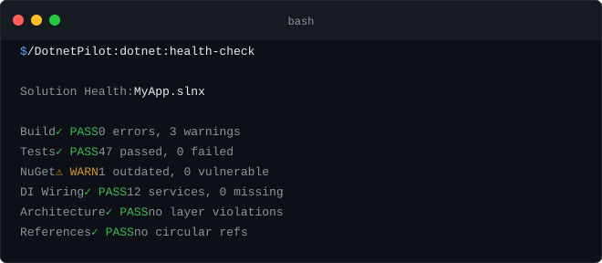
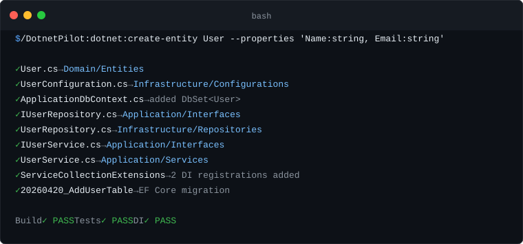
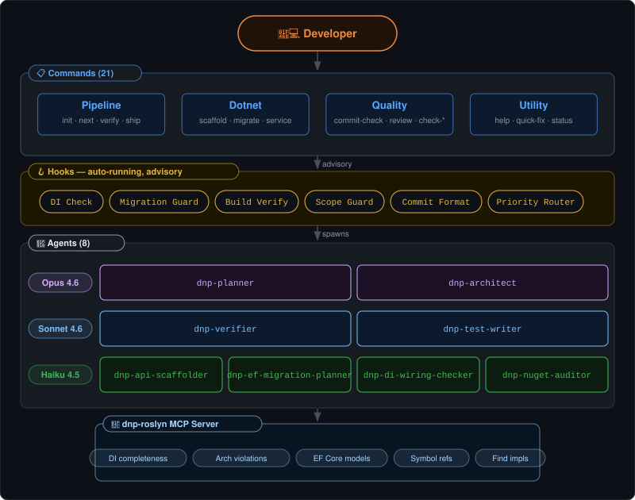

# 🚀 DotnetPilot

**A .NET development assistant plugin for [Claude Code](https://claude.ai/code)**

Roslyn-backed DI verification · EF Core migration safety · Clean-architecture enforcement · Convention-aware scaffolders

[](./LICENSE) [](https://dotnet.microsoft.com/) [](https://claude.ai/code) [](.)

*29 commands · 15 specialized agents · 11 hooks · 16 skill packs · 16 Roslyn MCP tools*

---

## Quick Install

```
/plugin marketplace add zdanovichnick/dotnet-pilot
/plugin install dotnet-pilot@dotnet-pilot-marketplace
/reload-plugins
```

```
dotnet tool install -g DotnetPilot.Mcp.Roslyn   # first install
dotnet tool update  -g DotnetPilot.Mcp.Roslyn   # update to latest
```

**Strongly recommended — enable auto-update** (one-time setup). GitHub-sourced marketplaces have auto-update disabled by default; without this step you'll have to update manually each release. Add to `~/.claude/settings.json`:

```json
{
  "extraKnownMarketplaces": {
    "dotnet-pilot-marketplace": { "autoUpdate": true }
  }
}
```

That's it. Open Claude Code in your `.sln` / `.slnx` directory and run `/dotnet-pilot:utility:help`.

---

## Why DotnetPilot?

AI coding tools make these .NET mistakes constantly — DotnetPilot fixes them at the source:

| Without DotnetPilot | With DotnetPilot |
| --- | --- |
| Creates services, forgets DI registration | `dnp-di-wiring-checker` catches it immediately |
| Manually edits EF migration files (breaks the chain) | `add-migration` always uses `dotnet ef migrations add` |
| Puts domain models in the wrong project layer | `dnp-architect` enforces clean architecture in real time |
| Skips `dotnet build` verification | Build hook verifies after every scaffold |
| Ignores existing patterns in your codebase | Every scaffolder reads your conventions before writing code |



---

## 📦 Installation

### Step 1 — Install the plugin

```
/plugin marketplace add zdanovichnick/dotnet-pilot
/plugin install dotnet-pilot@dotnet-pilot-marketplace
/reload-plugins
```



**Verify it worked:**

```
/dotnet-pilot:utility:help            → should list 29 commands
/dotnet-pilot:dotnet:health-check     → validates build, tests, DI, architecture
```

**Keeping it up to date.**

**Easiest:** Open the plugin manager (`/plugin` → Installed tab → `dotnet-pilot`) and click **"Update now"**. Then `/reload-plugins` to activate.

**CLI alternative:**

```
/plugin marketplace update dotnet-pilot-marketplace
/reload-plugins
```

**Auto-update** (GitHub-sourced marketplaces disable it by default). Enable once via the `/plugin` UI (Marketplaces tab → `dotnet-pilot-marketplace` → Enable auto-update), or persist it in `.claude/settings.json`:

```json
{
  "extraKnownMarketplaces": {
    "dotnet-pilot-marketplace": { "autoUpdate": true }
  }
}
```

> Once the plugin lands in `claude-plugins-official`, the install collapses to `/plugin install dotnet-pilot` — auto-update on by default.

**Alternative: install from a local clone**

Use this when you cloned the repo and want to run your own build, or contribute changes.

```
# Windows  (type in Claude Code chat)
/plugin marketplace add C:\path\to\dotnet-pilot

# macOS / Linux
/plugin marketplace add /path/to/dotnet-pilot
```

Then activate:

```
/plugin install dotnet-pilot@dotnet-pilot-marketplace
/reload-plugins
```

Session-only (plugin active only while this Claude Code process is running):

```
# Windows
claude --plugin-dir "C:\path\to\dotnet-pilot"

# macOS / Linux
claude --plugin-dir "/path/to/dotnet-pilot"
```

> After editing plugin source (commands, agents, hooks), run `/reload-plugins` to pick up changes without restarting.

### Step 2 — Install the Roslyn MCP server

```
dotnet tool install -g DotnetPilot.Mcp.Roslyn   # first install
dotnet tool update  -g DotnetPilot.Mcp.Roslyn   # update to the latest release
```

The plugin's `.mcp.json` auto-starts `dnp-roslyn` when Claude Code loads. It requires a `.sln` or `.slnx` file in your working directory.

### Step 3 — Enable Context7 (recommended)

In Claude Code, enable the **Context7** MCP server at the account level — planning agents use it for live NuGet / ASP.NET Core / EF Core documentation.

### Step 4 — Verify

```
/dotnet-pilot:utility:help            → should list 29 commands
/dotnet-pilot:dotnet:health-check     → validates build, tests, DI, architecture
```

---

## ⚡ Quick Start

### Initialize your project (once per solution)

```
/dotnet-pilot:project:init
```

Scans your solution, detects architecture style / test framework / EF contexts, and creates a user-scoped `.planning/` directory. Then asks three questions: what are you building, who is it for, what constraints exist.

### Create a full entity in one command



### Or go even faster with the shorthand

```
/dotnet-pilot:dotnet:create-entity Category --properties 'Name:string, SortOrder:int'
/dotnet-pilot:dotnet:create-api Category
/dotnet-pilot:dotnet:add-migration AddCategoryTable
```

---

## 🗺️ Architecture



**Flow:** Developer invokes a `/dotnet-pilot:*` command → the command spawns the right agent → the agent calls the Roslyn MCP server for semantic C# analysis (DI completeness, architecture violations, EF Core models, symbol references). Hooks run automatically on file writes and git events, feeding advisory feedback back to the command layer — they never block by default.

> **v2.0.0 breaking change:** Commands were renamed for clarity. `pipeline:*` → `project:*`, `scaffold-*` → `create-*`, `audit-*` → `check-*`, and several others. See the tables below for full mapping.

---

## 📋 Commands

### Project — project lifecycle

| Command | Usage | What it does |
| --- | --- | --- |
| `project:init` | `/dotnet-pilot:project:init [--refresh]` | Initialize for a .NET solution — discover projects, create `.planning/` directory, generate PROJECT.md and solution map |
| `project:next` | `/dotnet-pilot:project:next` | Auto-detect and suggest the next project step based on current state |
| `project:verify` | `/dotnet-pilot:project:verify` | Verify readiness before shipping — build, tests, DI completeness, and architecture check |
| `project:ship` | `/dotnet-pilot:project:ship [--draft]` | Create a pull request for completed work — runs final checks and invokes `gh pr create` |
| `project:checkpoint` | `/dotnet-pilot:project:checkpoint` | Ordered quality gate: build → tests → format check → architecture warning → DI warning → git status summary with a suggested commit message |

### Dotnet — scaffolding & solution management

| Command | Usage | What it does |
| --- | --- | --- |
| `dotnet:create-entity` | `create-entity <name> [--properties '...']` | Create a full entity stack: entity class, EF configuration, repository, service, DI registration, and migration |
| `dotnet:create-api` | `create-api <entity> [--minimal]` | Create API controller or minimal API endpoint with DTOs, validation, DI registration, and OpenAPI attributes |
| `dotnet:add-service` | `add-service <name> [--lifetime scoped\|transient\|singleton]` | Create a service with interface, implementation, DI registration, and test scaffold |
| `dotnet:add-endpoint` | `add-endpoint <controller> <method> <route> [--with-dto]` | Add an endpoint to an existing controller or endpoint group |
| `dotnet:add-migration` | `add-migration <name> [--context <Name>]` | Plan and generate an EF Core migration safely — validates chain, detects breaking changes, targets correct DbContext |
| `dotnet:add-project` | `add-project <name> <type>` | Add a new project to the solution with correct references and layer placement |
| `dotnet:write-tests` | `write-tests <class-or-method> [--style unit\|integration\|e2e]` | Generate tests for existing code — unit, integration, or WebApplicationFactory tests |
| `dotnet:tdd` | `tdd <task> [--complexity easy\|hard]` | Implement a feature using TDD — writes failing tests first, then production code |
| `dotnet:run-tests` | `run-tests [project] [--coverage] [--filter ...]` | Run tests with coverage reporting and failure diagnosis |
| `dotnet:health-check` | `health-check [--fix]` | Validate full solution health — build, tests, NuGet, project references, DI completeness |
| `dotnet:scaffold` | `scaffold <FeatureName> [--arch vsa\|clean\|ddd]` | Detect solution architecture via Roslyn, then scaffold a feature with the appropriate style — delegates to `dnp-api-scaffolder` with full context |
| `dotnet:build-fix` | `/dotnet-pilot:dotnet:build-fix` | Run `dotnet build`, capture output, and auto-fix errors iteratively — up to 5 cycles, then halts and reports what remains |

### Quality — safety checks

| Command | Usage | What it does |
| --- | --- | --- |
| `quality:commit-check` | `/dotnet-pilot:quality:commit-check` | Commit quality gate — build, test, format check, DI verification, and architecture check |
| `quality:review` | `review [--depth quick\|standard\|deep]` | Code review current changes with .NET-specific focus — async patterns, LINQ, naming, DI |
| `quality:check-packages` | `/dotnet-pilot:quality:check-packages` | Package vulnerability scan, version consistency check, and upgrade recommendations |
| `quality:check-architecture` | `/dotnet-pilot:quality:check-architecture` | Scan for clean architecture layer violations — forbidden project references, DI issues, package placement |
| `quality:security-scan` | `/dotnet-pilot:quality:security-scan` | Three-phase audit: `dotnet list package --vulnerable` → `dnp-security-auditor` OWASP scan → combined CRITICAL findings report |
| `quality:de-sloppify` | `de-sloppify [--scope path]` | Safe refactoring pass — dead code removal, naming normalization, duplication elimination. Requires tests passing first |

### Utility — housekeeping

| Command | Usage | What it does |
| --- | --- | --- |
| `utility:help` | `/dotnet-pilot:utility:help` | Show all commands with descriptions |
| `utility:quick-fix` | `quick-fix <task description>` | Quick fix — bypass the full pipeline for small changes |
| `utility:status` | `/dotnet-pilot:utility:status` | Show current project state — phase, progress, recent activity |
| `utility:settings` | `settings [key] [value]` | View and modify DotnetPilot configuration |
| `utility:show-solution` | `/dotnet-pilot:utility:show-solution` | Show the .NET solution structure — projects, references, packages, namespaces, layers |
| `utility:statusline` | `statusline [--manual]` | Install the .NET-aware statusline and wire it into `~/.claude/settings.json` (backs up any existing statusLine) |

---

## 🤖 Agents

Commands are thin orchestrators — all heavy work happens in one of these 15 agents, each with scoped tool access, a model tier, and a reasoning-effort level.

**Effort** is the second half of routing. Model tier sets *capability*; `effort:` sets how much reasoning is spent within that tier — so a mechanical check runs cheap on a capable model instead of being pushed onto a weaker one. Levels: `low` → `medium` → `high` → `xhigh` → `max`.

### Planning & verification

| Agent | Model | Effort | Role |
| --- | --- | --- | --- |
| `dnp-planner` | Opus | xhigh | Emits a .NET-aware, DI-conscious task list that maps 1:1 to `TaskCreate` entries |
| `dnp-verifier` | Sonnet | high | Goal-backward verification: build, tests, DI completeness, migration state, architecture rules |

### Deep advisory (consult, don't dispatch)

| Agent | Model | Effort | Role |
| --- | --- | --- | --- |
| `dnp-fable-advisor` | Fable | high | Read-only senior advisor to the *other* agents — ADVISE (shape a contract before implementation), UNBLOCK (diagnose a stuck agent's false premise), ADJUDICATE (rule on a disputed behavior claim against the DI-bound implementation). Advises, never implements. |

Reach for it at decision points, not before ordinary work. It requires Fable 5 access and has **no automatic fallback** — if Fable is unavailable, route the same question to `dnp-architect` (Opus / xhigh).

### Expert domain agents

| Agent | Model | Effort | Role |
| --- | --- | --- | --- |
| `dnp-architect` | Opus | xhigh | Solution architecture, clean-arch layer enforcement, project-reference and package-placement validation |
| `dnp-test-writer` | Sonnet | high | Test writer — xUnit/NUnit with mocking, `WebApplicationFactory` integration tests, convention-aware assertions |
| `dnp-tdd-developer-easy` | Sonnet | low | Fast TDD for routine .NET tasks — writes both tests and production code following RED-GREEN-REFACTOR |
| `dnp-tdd-developer-hard` | Sonnet | high | Deep TDD for complex .NET tasks — architectural decisions, ambiguous edge cases, cross-layer integration |
| `dnp-build-error-resolver` | Sonnet | low | Iterative build-error fixing — parses MSBuild output, applies targeted fixes, max 5 cycles before halting |
| `dnp-security-auditor` | Sonnet | high | OWASP Top 10 for .NET APIs — injection, secrets exposure, auth config, CORS, dependencies, input validation |
| `dnp-performance-analyst` | Sonnet | high | Async hotspots, EF Core N+1 queries, missing `CancellationToken`, caching gaps, benchmark design |
| `dnp-refactor-cleaner` | Sonnet | high | Dead code removal, naming normalization, duplication elimination — behavior preserved, verified by tests after each step |

### Mechanical agents (fast, focused)

| Agent | Model | Effort | Role |
| --- | --- | --- | --- |
| `dnp-api-scaffolder` | Sonnet | low | Generates controllers or minimal API endpoints with DTOs, validation, OpenAPI attributes, DI registration |
| `dnp-ef-migration-planner` | Sonnet | low | Plans safe EF Core migrations — detects breaking changes, validates chain integrity, targets correct DbContext |
| `dnp-di-wiring-checker` | Sonnet | low | Cross-references constructor injection against DI registrations — finds missing services and captive dependencies |
| `dnp-nuget-auditor` | Sonnet | low | Scans for vulnerable, outdated, and version-inconsistent NuGet packages across the solution |

> `dnp-test-writer` writes tests only (given existing production code). `dnp-tdd-developer-*` agents own the full TDD loop: write failing test → implement production code → refactor — and handle DI registration, architecture verification, and build checks as part of the cycle.
>
> The mechanical agents moved off Haiku in v2.6.0. Effort is model-gated and **unsupported on Haiku 4.5**, so `haiku + effort: low` is a silent no-op — those agents run on Sonnet at `effort: low` instead, which is where the cost/capability trade-off they were reaching for actually lives.
>
> Models are tier aliases (`opus`/`sonnet`/`haiku`/`fable`), not dated IDs, so frontmatter tracks each tier's current default and needs no bump on a model release.

---

## 🪝 Hooks

Hooks run automatically during Claude Code sessions. Advisory hooks warn but don't block, and they respect per-project toggle settings in `.planning/config.json`. The sync hook keeps the global `CLAUDE.md` up to date with the plugin's rule set. One hook (**Git Auto-Approve**) is non-advisory by design — it speaks the PreToolUse permission protocol to skip prompts on safe git/gh commands.

| Hook | Trigger | What it does |
| --- | --- | --- |
| **Global CLAUDE.md Sync** | Before any tool use (once per version) | Injects/updates the DotnetPilot rule block in `~/.claude/CLAUDE.md` — runs once after plugin install/update, then fast-path skips |
| **Git Auto-Approve** | Before `git`/`gh` Bash commands | Returns `permissionDecision: allow` for safe single git/gh commands (status/diff/log/add/commit/branch/push, `gh pr create`) so commit + PR run without a prompt; falls through to the normal prompt for chained/unsafe commands. Toggle `hooks.git_autoapprove: false` to disable |
| **DI Registration Check** | After writing/editing `.cs` files | New services missing DI registration |
| **Migration Guard** | Before writing/editing migration files | Warns when manually editing EF migration files |
| **Project Scope Guard** | After writing/editing any file | Warns when editing outside the current phase's focused projects |
| **Build Verify** | After `dotnet build` runs | Parses failures, tracks consecutive errors, aborts after 5 |
| **Post-Edit Format** | After Write/Edit/MultiEdit on `.cs` files | Runs `dotnet format --include <file>` on the nearest project; skips `obj/`, `bin/`, `Migrations/`, generated files |
| **Commit Format** | Before `git commit` | Enforces `type(scope): message` conventional commit format |
| **Priority Router** | Before spawning an Agent | Detects .NET projects and injects DotnetPilot agent routing priority over generic equivalents; also steers C# code inspection to `mcp__roslyn__` over `mcp__*code-analyzer__`. Toggle `hooks.dotnet_priority: false` to disable |
| **Code-Analyzer Redirect** | Before a `code-analyzer` MCP tool call | When the call targets C# (a `.cs` file, a .NET `project_path`, or a .NET cwd), nudges toward the C#-aware `mcp__roslyn__` tools — the Python/TS/JS code-analyzer has no C# support. Advisory only; never blocks. Toggle `hooks.code_analyzer_redirect: false` to disable |
| **Statusline Sync** | On session start/resume/clear/compact | Refreshes the installed statusline script at `~/.claude/dnp-statusline.js` when the plugin ships a newer version. Only wires `~/.claude/settings.json` when `statusline.auto_enable: true` (default off) — never clobbers an existing statusLine without opt-in |

---

## 📊 Statusline

A compact, .NET-aware statusline. Install it with `/dotnet-pilot:utility:statusline`:

- **Line 1 (always):** `🤖 <model> │ ⚡ EFF <effort>[ (set: <configured>)] │ 🧠 <bar> <pct>% · <tokens> │ 🌿 <branch> ✚<dirty> ↑<ahead>↓<behind> │ ⏱ <elapsed> │ 💰 $<cost>`
- **Line 2 (only inside a .NET solution):** `📦 SLN <name> │ 🎯 TFM <framework> │ ❌ BUILD <n>x`
- **Line 3 (only inside a .NET solution):** `💡 TIP <rotating DotnetPilot command hint>` — a slowly-rotating pointer to the plugin's commands, for discovery

Every segment carries an emoji icon and a saturated color on its **value** (labels stay dim), so the data reads before the scaffolding. Three segments are threshold-colored rather than fixed: the 🧠 context bar and percentage (green → yellow → red past 50 / 75 / 90%), the ⚡ effort level (dim `low` up to bold red `max`), and the 💰 cost (green → yellow → red past \$2 / \$10). Set `NO_COLOR` for plain text.

`⚡ EFF <effort>` shows the **live per-turn** reasoning-effort level (`low`/`medium`/`high`/`xhigh`/`max`) when Claude Code pipes it — it reflects mid-session `/effort` changes and the resolved level under `auto` (not a static config value), and is color-coded by level (brightest at the top of the scale) so a change is obvious at a glance; omitted when the model doesn't support effort. When the level you configured is not the one in force, a yellow `(set: <configured>)` suffix names it — e.g. `EFF high (set: xhigh)`.

`BUILD ✗ Nx` reflects the same failure state the **Build Verify** hook records (so it also surfaces `dotnet test` failures); absence means "no recent failure recorded", not a guaranteed green build.

Claude Code plugins cannot register a `statusLine` directly, and `${CLAUDE_PLUGIN_ROOT}` is not expanded in statusLine command strings — so the command installs the script to a stable path (`~/.claude/dnp-statusline.js`) and points `settings.json` at it. It detects and backs up any existing statusLine before replacing (or run with `--manual` to print the snippet instead). To activate automatically every session, set `statusline.auto_enable: true` in `.planning/config.json`; it coexists with — never silently replaces — another statusline unless you opt in. Honors `NO_COLOR`.

---

## 📚 Skill Packs

Skills are on-demand knowledge packs loaded by agents when needed — they encode .NET conventions that would otherwise require repeated prompting.

| Skill | What it teaches |
| --- | --- |
| `aspnet-api-patterns` | Minimal APIs, controller patterns, middleware, filters, OpenAPI |
| `ef-core-patterns` | DbContext design, migrations, query optimization, owned entities |
| `testing-dotnet` | xUnit conventions, NSubstitute, `WebApplicationFactory`, Testcontainers |
| `clean-architecture` | Layer rules, project layout, dependency direction, shared kernel |
| `blazor-patterns` | SSR vs WASM, component lifecycle, forms, state management |
| `dotnet-project-init` | Solution setup, NuGet config, CI scaffolding |
| `modern-csharp` | C# 12–14: primary constructors, collection expressions, records, pattern matching, `field` keyword |
| `error-handling` | `Result<TValue,TError>`, `ProblemDetails`, `GlobalExceptionHandler`, exception boundaries |
| `resilience` | Polly v8 `ResiliencePipelineBuilder`, retry, circuit breaker, timeout, hedging, `IHttpClientFactory` |
| `caching` | `HybridCache` (.NET 9+), `IOutputCache`, cache-aside, `IMemoryCache`, typed cache keys |
| `authentication` | JWT bearer, ASP.NET Identity, OIDC, policy-based auth, `IAuthorizationHandler` |
| `vertical-slice` | Feature folders, `IEndpointGroup`, endpoint filters, no shared base classes |
| `ddd` | `AggregateRoot<TId>`, value objects, strongly-typed IDs, domain events, repository interfaces |
| `convention-learner` | 6-step protocol: detect naming, folder structure, DI style, test framework, DTO style, error handling before writing any code |
| `logging` | Serilog setup, message templates (not interpolation), `LogContext`, request logging, PII rules |
| `opentelemetry` | `ActivitySource`, `IMeterFactory`, OTLP config, Aspire `AddServiceDefaults()`, Serilog correlation |

---

## 📖 Use Cases

**1. Scaffold a CRUD entity end-to-end in 30 seconds**

```
> /dotnet-pilot:dotnet:create-entity Category --properties 'Name:string, Description:string?, SortOrder:int'

Created 9 files:
  src/ECommerce.Domain/Entities/Category.cs
  src/ECommerce.Infrastructure/Configurations/CategoryConfiguration.cs
  src/ECommerce.Infrastructure/Data/ApplicationDbContext.cs        (added DbSet<Category>)
  src/ECommerce.Application/Interfaces/ICategoryRepository.cs
  src/ECommerce.Infrastructure/Repositories/CategoryRepository.cs
  src/ECommerce.Application/Interfaces/ICategoryService.cs
  src/ECommerce.Application/Services/CategoryService.cs
  src/ECommerce.Api/Extensions/ServiceCollectionExtensions.cs      (2 DI registrations added)
  Migration: 20260420_AddCategoryTable

Build: PASS · Tests: PASS · DI: PASS

> /dotnet-pilot:dotnet:create-api Category

Created 4 files:
  src/ECommerce.Api/DTOs/CreateCategoryRequest.cs
  src/ECommerce.Api/DTOs/CategoryResponse.cs
  src/ECommerce.Api/Controllers/CategoriesController.cs
  src/ECommerce.Api/Validators/CreateCategoryRequestValidator.cs

Build: PASS
```

**2. Safely migrate a project with multiple DbContexts**

```
> /dotnet-pilot:dotnet:add-migration AddCompanyNameToTenant


Multiple DbContexts detected. Which one?
  1. ApplicationDbContext (Infrastructure, 12 entities)
  2. TenantDbContext (Infrastructure, 4 entities)
→ 2

Checking for breaking changes...
  Analysis: Adding nullable column CompanyName — safe, no data loss.
  Chain: 7 existing migrations, chain valid.

Running: dotnet ef migrations add AddCompanyNameToTenant
  --project src/ECommerce.Infrastructure
  --startup-project src/ECommerce.Api
  --context TenantDbContext

Build: PASS · Dry run: PASS
Committed: feat(Infrastructure): add migration AddCompanyNameToTenant
```

**3. Catch architecture violations before they ship**

```
> /dotnet-pilot:quality:check-architecture

Architecture Audit: ECommerce.slnx
  Style: clean

  Violations (1):
    [ERROR] ECommerce.Domain → ECommerce.Infrastructure
            Domain should not reference Infrastructure.
            Fix: Move the shared helper to Domain, or create an interface
            in Application that Infrastructure implements.
```

**4. Find and fix missing DI registrations**

```
> /dotnet-pilot:dotnet:health-check

  DI Wiring:    FAIL (15 services, 2 missing)

  Missing:
    IPaymentGateway      → consumed by OrderService (Application/Services/OrderService.cs:14)
    INotificationService → consumed by OrderCompletedHandler (Application/Handlers/...:9)

> /dotnet-pilot:dotnet:health-check --fix

  Fixed ServiceCollectionExtensions.cs:
    + services.AddScoped<IPaymentGateway, StripePaymentGateway>();
    + services.AddScoped<INotificationService, EmailNotificationService>();

  DI Wiring:    PASS (17 services, 0 missing)
```

**5. Pre-commit quality gate**

```
> /dotnet-pilot:quality:commit-check

  [PASS] Build:        0 errors
  [PASS] Tests:        72 passed
  [WARN] Format:       2 files need formatting
  [PASS] DI Wiring:    all services registered
  [PASS] Architecture: no violations

  Ready to commit. Run `dotnet format` to fix formatting issues.
```

**6. Deep code review before a PR merge**

```
> /dotnet-pilot:quality:review --depth deep


  [HIGH]   UserService.cs:45
           Async method calls .Result on a Task — deadlocks under ASP.NET Core.
           Fix: await the call instead.

  [HIGH]   UsersController.cs:28
           SQL injection: string interpolation in LINQ query with user input.
           Fix: use parameterized queries or LINQ expressions.

  [MEDIUM] OrderRepository.cs:62
           N+1 query: .Include() inside a loop. Use eager loading outside.

  [LOW]    OrderService.cs:15
           ILogger injected but never used. Remove or add error-path logging.

  4 issues found: 2 high · 1 medium · 1 low
```

---

## ⚙️ Configuration

After `/dotnet-pilot:project:init`, configuration lives at `~/.claude/projects/<flat-repo-path>/.planning/config.json`.

```json
{
  "dotnet": {
    "solution_path": "MyApp.slnx",
    "target_framework": "net10.0",
    "test_framework": "xunit",
    "ef_contexts": ["ApplicationDbContext"],
    "architecture_style": "clean",
    "use_minimal_api": false,
    "central_package_management": false
  },
  "hooks": {
    "di_check": true,
    "migration_guard": true,
    "project_scope_guard": true,
    "build_verify": true,
    "post_edit_format": true,
    "commit_format": true
  },
  "statusline": {
    "auto_enable": false
  },
  "workflow": {
    "build_after_task": true,
    "test_after_task": true,
    "di_check_on_write": true
  }
}
```

Use `/dotnet-pilot:utility:settings <key> <value>` to change values without editing JSON directly.


| Setting | Change to | Reason |
| --- | --- | --- |
| `hooks.di_check` | `false` | DI advisory is too noisy for your workflow |
| `hooks.project_scope_guard` | `false` | You routinely edit across multiple projects at once |
| `hooks.commit_format` | `false` | Skip conventional-commit enforcement |
| `statusline.auto_enable` | `true` | Auto-install + wire the .NET statusline every session (backs up any existing statusLine once) |
| `workflow.build_after_task` | `false` | Skip automatic build after every scaffold |

---

## 🔬 What the Roslyn MCP Server provides

`dnp-roslyn` gives DotnetPilot semantic understanding of your C# code — not regex guessing.

| Tool | What it does |
| --- | --- |
| `get_solution_structure` | Projects, references, frameworks, document counts |
| `get_class_outline` | Member signatures (no bodies) for a class |
| `get_method_body` | Full source of a specific method/constructor/property |
| `find_references` | Cross-solution symbol references |
| `find_implementations` | Interface/abstract class implementations |
| `find_di_registrations` | All service registrations (`AddScoped`, `AddTransient`, etc.) |
| `find_di_consumers` | All constructor-injected types |
| `check_di_completeness` | Missing registrations + captive dependency detection |
| `check_architecture_violations` | Clean architecture layer rule enforcement |
| `get_ef_models` | DbContexts, entities, properties, navigations |
| `find_symbol` | Locate any type, method, or property by name across the solution |
| `find_callers` | Find all callers of a specific method (call graph, not text search) |
| `find_dead_code` | Identify unreferenced types and members — confidence-scored by accessibility |
| `detect_antipatterns` | Syntax-level scan: `async void`, `.Result`/`.Wait()`, `new HttpClient()`, log interpolation, `Thread.Sleep`, missing `CancellationToken`, broad `catch (Exception)`, `DateTime.Now` |
| `detect_circular_dependencies` | DFS cycle detection across project reference graph |

> Without dnp-roslyn, DI checking falls back to regex-based hooks (less accurate). Roslyn tools only activate when Claude Code is opened inside a `.sln` / `.slnx` directory.

---

## 🚫 What DotnetPilot does NOT do

DotnetPilot deliberately avoids wrapping stock Claude Code capabilities — use them directly:

| Task | Native Claude Code alternative |
| --- | --- |
| Multi-step planning | **Plan Mode** (`EnterPlanMode`) + `TaskCreate` |
| General code review | Stock `code-reviewer` agent |
| Security audit | Stock `/security-review` command |
| Library research | Context7 MCP or `WebSearch` |
| Tracking work within a conversation | `TaskCreate` / `TaskUpdate` |
| Gathering user intent | `AskUserQuestion` |
| Initial CLAUDE.md | Stock `/init` |

DotnetPilot wins only for **.NET-specific behavior**: Roslyn semantics, EF migration chains, DI wiring across project boundaries, clean-architecture layer rules, and scaffolders that match your existing project conventions.

---

## 🔍 Troubleshooting

**"Failed to reconnect to plugin:dotnet-pilot:roslyn"**

`dnp-roslyn` couldn't find a `.sln` or `.slnx` file in the current directory. Navigate to your solution directory and restart Claude Code there.

```
dnp-roslyn doctor    # shows solution detection status
```

**"DotnetPilot not initialized"**

Most commands work without init. If `project:next` or `utility:status` reports this, run `/dotnet-pilot:project:init` once to create the `.planning/` directory.

**Hooks are too noisy**

```json
{ "hooks": { "di_check": false, "project_scope_guard": false } }
```

Or: `/dotnet-pilot:utility:settings hooks.di_check false`

**Build keeps failing after scaffolding**

DotnetPilot aborts after 5 consecutive build failures. Check that `dotnet build` works manually, then run `/dotnet-pilot:dotnet:health-check --fix` for auto-repair.

**Commands missing after update (e.g. `dotnet:tdd` not found)**

Claude Code caches the plugin at install time. After a major version update, new command files may not appear until the cache is refreshed.

**Option 1 — UI (easiest):** `/plugin` → Installed → `dotnet-pilot` → **"Update now"** → `/reload-plugins`

**Option 2 — short CLI reset:**

```
/plugin uninstall dotnet-pilot
/plugin install dotnet-pilot@dotnet-pilot-marketplace
/reload-plugins
```

**Option 3 — full reset** (if Options 1 & 2 don't work):

```
/plugin uninstall dotnet-pilot
/plugin marketplace remove dotnet-pilot-marketplace
/plugin marketplace add zdanovichnick/dotnet-pilot
/plugin install dotnet-pilot@dotnet-pilot-marketplace
/reload-plugins
```

Verify: `/dotnet-pilot:utility:help` — should list 29 commands including `dotnet:tdd`, `dotnet:build-fix`, and `quality:security-scan`.

**"Context7 tools not available"**

Context7 must be enabled at the account level in Claude Code settings.

---

## 📅 Roadmap

| Version | Status | Changes |
| --- | --- | --- |
| v0.1 | ✅ shipped | Core pipeline + agents + hooks |
| v0.2 | ✅ shipped | Roslyn MCP server: DI analysis, solution structure, file-level queries, architecture checker |
| v0.3 | ✅ shipped | Roslyn: EF Core model introspection, verbose stderr logging |
| v1.0.0 | ✅ shipped | Scope narrowed; retired spec-driven pipeline; pinned model IDs; hardened hooks; hook test harness |
| v1.1.0 | ✅ shipped | `pipeline:init/next/status` merged to core; `pipeline:verify` added; user-scoped `.planning/` path; planner & architect upgraded to Opus 4.7; plugin published to Claude Platform as `dotnet-pilot` |
| v2.0.0 | ✅ shipped | **Breaking:** 12 commands renamed for clarity (`pipeline:*` → `project:*`, `scaffold-*` → `create-*`, `audit-*` → `check-*`, and others). New: `dotnet:write-tests` and `dotnet:tdd` commands (21 → 23). New: global `CLAUDE.md` sync hook auto-injects .NET code-style rules on plugin install/update (5 → 6 hooks). Marketplace version synced. |
| v2.1.1 | ✅ shipped | New: `.NET priority routing` hook — auto-detects .NET projects and injects DotnetPilot agent routing priority before generic agents are spawned (6 → 7 hooks). |
| v2.2.0 | ✅ shipped | **Major content expansion.** +10 skills (modern C#, error handling, resilience, caching, auth, VSA, DDD, convention learner, logging, OpenTelemetry). +9 knowledge docs (anti-patterns, package recommendations, common infrastructure snippets, breaking changes, 5 ADRs). +4 agents (build-error-resolver, security-auditor, performance-analyst, refactor-cleaner). +5 commands (scaffold, build-fix, security-scan, de-sloppify, checkpoint). +5 templates (web-api, modular-monolith, blazor-app, worker-service, class-library). Post-edit auto-format hook. |
| v2.2.1 | ✅ shipped | **Fix:** ship the 5 Roslyn MCP tools that were referenced by agents but never implemented — `find_symbol`, `find_callers`, `find_dead_code`, `detect_antipatterns`, `detect_circular_dependencies`. Roslyn server bumped to `0.5.0`. Tool count 10 → 15. |
| v2.2.2 | ✅ shipped | **Model routing:** every agent switched from pinned/dated model IDs to tier aliases (`opus`/`sonnet`/`haiku`) so frontmatter auto-tracks each tier's current default and needs no bump on future model releases (e.g. Opus 4.8). Synced the model columns in `README.md` and `CLAUDE.md`, the command delegate-notes, and the architecture diagram. Also adds a Git rule to the injected global `CLAUDE.md` — fetch `CODEOWNERS` reviewers when opening PRs. |
| v2.3.0 | ✅ shipped | New: `Git Auto-Approve` hook — returns `permissionDecision: allow` for safe single `git`/`gh` commands (status/diff/log/add/commit/branch/push, `gh pr create`, heredoc commit) so commit + PR skip the permission prompt (7 → 8 hooks). Plus doc-drift fixes and hook robustness hardening. |
| v2.4.0 | ✅ shipped | **.NET-first tooling priority.** New `Code-Analyzer Redirect` advisory hook + extended `Priority Router` steer C# code inspection to `mcp__roslyn__` over kouhesion's Python `code-analyzer` (which has no C# support); adds a `.NET-First Tooling Priority` rule to the injected global `CLAUDE.md`; shared `_lib/dotnet.js` detection (with parent walk-up); both priority hooks are now config-toggleable (8 → 9 hooks). |
| v2.5.0–2.5.3 | ✅ shipped | **.NET-aware statusline.** New `statusline/dnp-statusline.js` (model, context, git, elapsed, cost + a .NET line with solution / TFM / build-fail count) plus the `dnp-statusline-sync` SessionStart hook and `/dotnet-pilot:utility:statusline` installer (9 → 11 hooks). Added the reasoning-effort segment, colour-coded it by level, and fixed a `sha1(cwd)` build-fail state collision shared with `dnp-build-verify`. |
| v2.6.0 | ✅ shipped | **Effort-aware routing + Fable advisor.** Every agent and command now carries an explicit `effort:` level, so reasoning spend is routed independently of model tier. The 6 Haiku agents moved to **Sonnet + `effort: low`** — effort is unsupported on Haiku 4.5, so the old pairing would have been a silent no-op. New `dnp-fable-advisor` (Fable 5, read-only, ADVISE / UNBLOCK / ADJUDICATE) for decision-point consults (14 → 15 agents). Statusline now renders `⚙ <active>≠<configured>` when the configured effort level is not actually in force — the failure mode that made a stale `CLAUDE_CODE_EFFORT_LEVEL` pin look like a statusline bug. |
| v2.7.0 | ✅ shipped | **Statusline restyle.** The effort segment drops the double-width `⚙` glyph for an `EFF` label, and its configured-level mismatch now reads as a spelled-out `(set: <configured>)` instead of a cramped `≠<configured>`. Every segment gained an emoji icon and a saturated **value** color (labels stay dim), context usage renders as a threshold-colored 10-cell bar, and cost/context/effort now ramp green → yellow → red with pressure — following the icon + progress-bar style of the [official statusline docs](https://code.claude.com/docs/en/statusline). **Context-engineering pass for Claude 5.** The two TDD agents shed 680 lines of guardrail scaffolding — anti-rationalization tables, epistemic-gate and predict-first protocols, `LLM-1..6` self-verification checklists, and six pages of few-shot ideal-output transcripts — keeping the .NET gotchas that the model can't infer. Test-tier selection, mock-fidelity rules, and boundary-coverage tables moved into the `testing-dotnet` skill, loaded on demand instead of inlined. The global `CLAUDE.md` rules block lost a live contradiction ("prefer explicit types" vs "always use `var`") and its duplicated .NET style sections. `dnp-dotnet-priority` stopped re-injecting the 16-line agent roster on every `Agent` call — Claude Code already surfaces agent descriptions. Command references corrected from the never-valid `/DotnetPilot:` prefix to `/dotnet-pilot:` (109 occurrences). New **Comments** rule in the injected global block — default to none, and a comment earns its place only where the code cannot say the thing itself; `dnp-test-writer`'s example test dropped its `// Arrange` / `// Act` / `// Assert` labels, which had been demonstrating the opposite of the stated convention. |
| v2.8 | 🔜 planned | MAUI / mobile support |

---

## Requirements

| Dependency | Version | Purpose |
| --- | --- | --- |
| [Claude Code](https://claude.ai/code) | Latest | AI coding assistant (CLI, desktop, or IDE) |
| [.NET SDK](https://dotnet.microsoft.com/) | 10+ | Your .NET project must build |
| [Node.js](https://nodejs.org/) | 18+ | Hooks are JS scripts executed by Claude Code |
| [dnp-roslyn](https://github.com/zdanovichnick/dotnet-pilot-mcp-roslyn) | v0.3+ | Roslyn MCP for semantic C# analysis |
| [Context7](https://github.com/upstash/context7) | latest | Live docs for planning agents (recommended) |
| [jq](https://jqlang.github.io/jq/) | any | Better JSON parsing in commit-format hook (optional) |
| [GitHub CLI](https://cli.github.com/) | any | Required only for `project:ship` (optional) |

**.NET SDK**
```
winget install Microsoft.DotNet.SDK.10   # Windows
brew install dotnet-sdk                  # macOS
sudo apt-get install -y dotnet-sdk-10.0  # Ubuntu/Debian
```

**Node.js**
```
winget install OpenJS.NodeJS   # Windows
brew install node              # macOS
sudo apt-get install -y nodejs # Ubuntu/Debian
```

**dnp-roslyn**
```
dotnet tool install -g DotnetPilot.Mcp.Roslyn
dotnet tool update  -g DotnetPilot.Mcp.Roslyn
dnp-roslyn version
```

**jq (optional)**
```
winget install jqlang.jq   # Windows
brew install jq            # macOS
sudo apt-get install -y jq # Ubuntu/Debian
```

**GitHub CLI (optional)**
```
winget install GitHub.cli  # Windows
brew install gh            # macOS
sudo apt-get install -y gh # Ubuntu/Debian
```

---

**[Nick Zdanovych](https://github.com/zdanovichnick)** · <zdanovichnick@gmail.com>

MIT License · © 2026