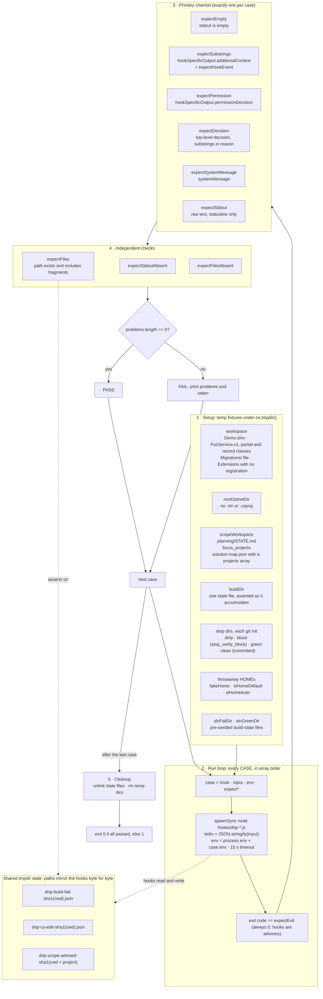
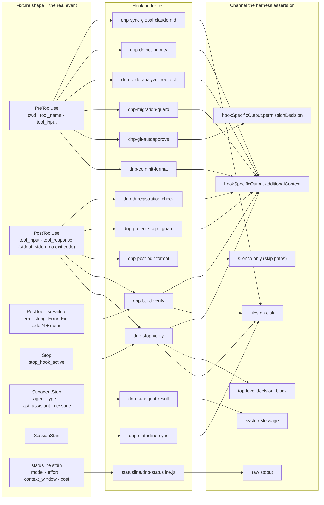

# Hook test harness

Run from the plugin root:

```bash
node hooks/__tests__/run.js                # hook harness
node hooks/__tests__/check-consistency.js  # versions, frontmatter, README tables, references
```

`run.js` spawns every hook in `hooks/*.js` (and the statusline script) as a child process,
pipes a fixture JSON payload into stdin shaped like the real Claude Code event, and asserts
on the exit code, the output channel the hook is supposed to use, and any files it wrote.
Hooks are advisory, so the exit code is always expected to be 0.

## How a run works



Every mismatch is appended to the case's `problems` list, so one case can report an exit
code problem, a missing substring, and a missing file together.

## What each hook is fed, and where it must speak

The fixture is the contract: a payload keyed the way the real event is keyed. `PostToolUse`
carries `tool_response` and no exit code; a non-zero exit only reaches a hook as the
`PostToolUseFailure` string `error`. A hook that reads the wrong key passes silently in
production and fails here.



## Adding a case

- Append to the `CASES` array in `run.js`. Pick exactly one primary `expect*` channel;
  `expectStdoutAbsent`, `expectFiles` and `expectFilesAbsent` stack on top of it.
- Reuse a fixture directory when one fits. A new `mkdtempSync` directory must also be added
  to the cleanup list at the bottom of the file, or it leaks into `os.tmpdir()`.
- A hook that writes under `HOME` gets `env: { HOME, USERPROFILE }` pointing at a throwaway
  directory. Never let a case touch the developer's real `~/.claude`.
- Cases run in array order. `dnp-build-verify` cases share one state file and assert the
  consecutive-failure count as it grows; `dnp-stop-verify` stamps its edit marker on a
  `PostToolUse` case and reads it on the following `Stop` case. Insert between them only
  if the count sequence still holds.
- The `buildStatePath`, `editMarkerPath` and `scopeAdvisedPath` helpers must stay identical
  to the hooks' own path functions, or the fixture seeds one file and the hook reads another.

## When to run

- After editing any hook, command, agent, or the statusline script.
- Before bumping the plugin version.
- CI runs both scripts on Ubuntu and Windows (`.github/workflows/hooks.yml`), then validates
  agents, commands and skills with `claude plugin validate --strict`.
